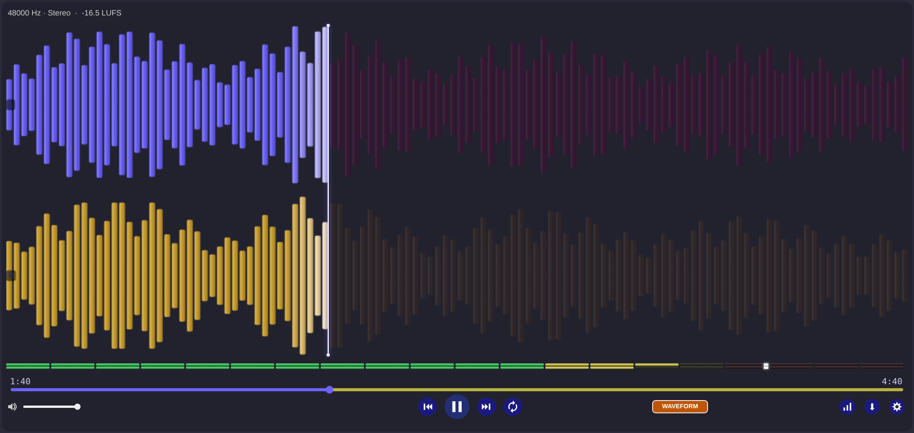
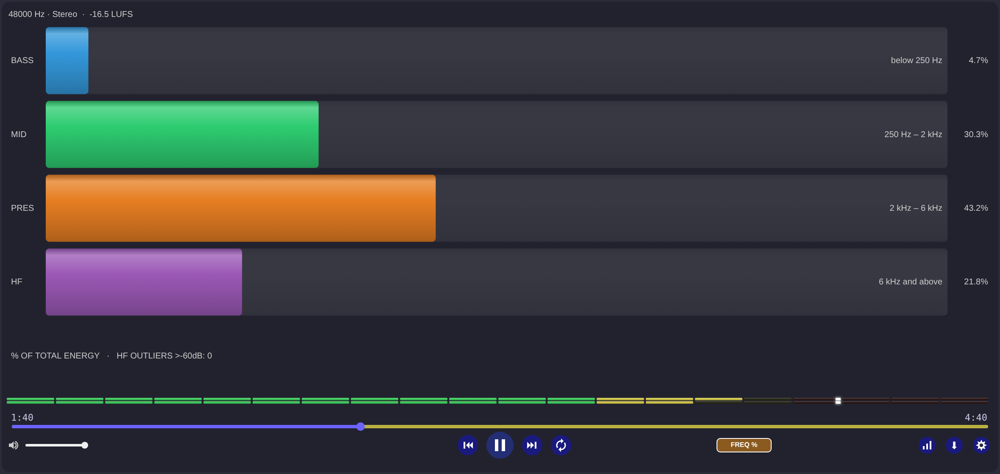
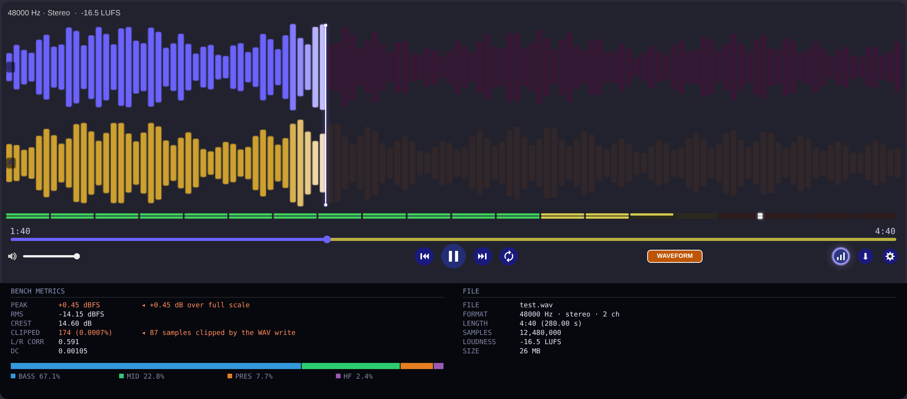
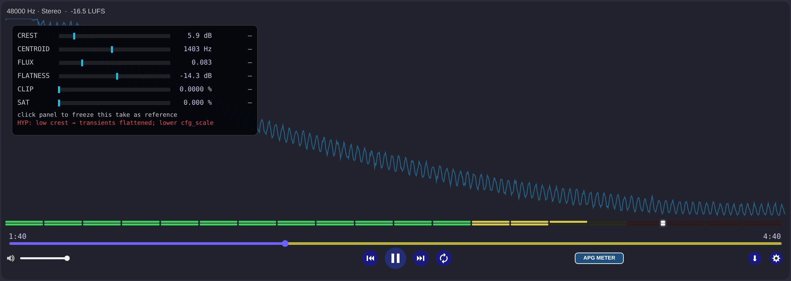
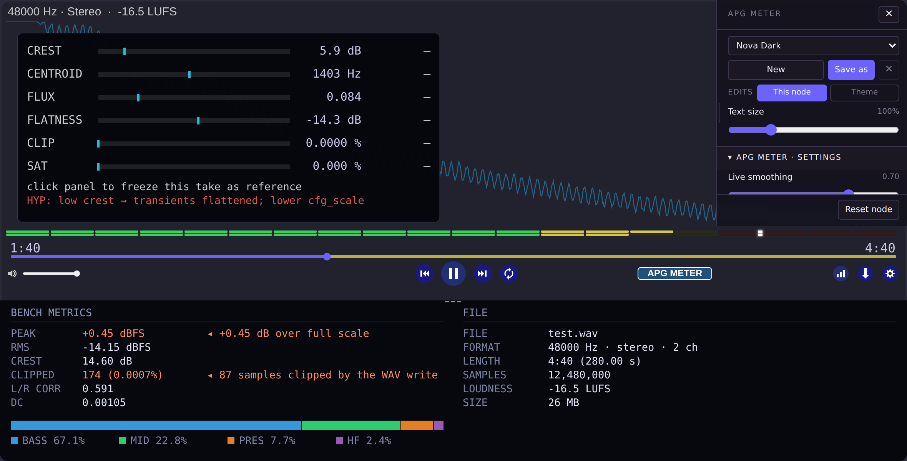

# Nova Audio Player

An audio player node for ComfyUI with twelve live visualisers, a whole-file
measurement panel, and a theme system you can drive from inside the node.

Built for listening to what a generation actually produced — not just playing it
back.

<!-- Replace with a screenshot of the node in your own workflow -->


---

## Install

Clone into your ComfyUI custom nodes folder and restart:

```bash
cd ComfyUI/custom_nodes
git clone https://github.com/NovaFemme/ComfyUI-NovaAudioPlayer.git
```

No dependencies beyond what ComfyUI already ships. `scipy` is used for accurate
LUFS if present, and the node falls back to plain RMS if it is not.

Drop the **Nova Player 🔊** node into a workflow and connect any `AUDIO` output.

---

## What you get

### Twelve views, one button

Cycle them with the pill in the transport row. Every view is a separate module
and every one is themeable.

| | |
|---|---|
| **Waveform** | Stereo peak bars with a pulse at the playhead |
| **Spectrum / EQ** | Filled spectrum curve with a neon rim |
| **Analyzer** | Goniometer and phase-correlation needle |
| **Spectrogram** | Scrolling heat map, on a real time axis |
| **Combined** | Waveform, spectrum and spectrogram together |
| **Peak / RMS** | Level meters with peak hold and decay |
| **L/R Correlation** | Phase relationship over time |
| **Freq %** | Energy split across four contiguous bands |
| **Combined Suite** | Meters, correlation and bands in one view |
| **FFT Analyzer** | High-resolution spectrum with peak hold |
| **RTA Analyzer** | 1/3-octave real-time analyser |
| **APG Meter** | Artifact metrics for tuning generation settings |



<!-- Add your own screenshots here — one per view you want to show off -->

### An output you can log

The node returns **`panel_info`** — everything in the bench strip as a string,
ready for a display node or a database. The `panel_format` widget picks the
shape: `json` for a parser, `text` for reading, `csv_row` for appending to a
log. It is built from the same numbers the panel draws, so a logged take and
the screen can never disagree.

### It works before you wire anything

Place the node and it is already a player — chrome, transport, view pill, and a
visualiser animating a synthetic signal so you can see what each view does. The
badge row says `no audio connected · press play for a demo`; pressing play runs
a four-second clip through the real analyser, so the first thing you see is a
genuine measurement rather than a mock-up.

Connect an `AUDIO` output and all of it is gone for good. Nothing is fetched or
played until you ask for it.

### Downloads

The download arrow offers **WAV**, **FLAC** and **OGG** — everything
`soundfile` can write, with no external binary involved.

There is deliberately no MP3, M4A, Opus or WebM. Those needed ffmpeg, reached
through a `subprocess` call, and the Comfy registry's scanner flagged the two
releases that contained it. A node nobody can install exports nothing at all,
so the four lossy formats went rather than the release. If you want an mp3, the
WAV is one ffmpeg command away.

### A bench panel that agrees with itself

Click the bar-chart button next to the download arrow. Everything in the strip
is measured **once**, in Python, from the same audio the waveform and the
loudness badge come from — so nothing on screen can disagree with anything else
on screen.



It reports the peak **before** the WAV write clamps it, so a generation that
overshoots full scale tells you so instead of silently arriving pre-clipped.
Band shares are contiguous and always total 100%.

Drag its top edge to make it taller.

### The APG meter

Six artifact metrics — crest, spectral centroid, flux, flatness, clipping and
flat-top saturation — each shown live and integrated over the whole take.



Click the panel to freeze a reference take. Every row then shows a delta against
it, so you can change one generation setting, render again, and read which way
the audio moved. There is a directional hint line, and it is clearly marked as a
hypothesis rather than a measurement.

[Full explanation of what each metric means and where the numbers came from →](docs/design/07-apg-artifact-meter.md)

### Themes, and a settings drawer that stays out of your way

Click the gear. You get colours for the view you are currently looking at, that
view's own settings, and the shared player chrome — not a wall of every colour in
the node.



Everything autosaves. The only save button is for themes.

**Edits: This node / Theme.** Colour changes can stay with this one player
(saved in your workflow) or be written to the theme on disk for every player
using it. There is a button to promote node changes to the theme when you like
what you have.

**Text size** and **bar relief** sliders live with the theme controls. Both are
display preferences rather than theme content, so switching theme does not
change them.

---

## Tips

- **Working on a 1440p or 4K display?** Turn up **Text size** in the settings
  drawer. The defaults were chosen against 1080p.
- **Bars look flat?** **Bar relief** controls the 3D shading. The lighting is
  derived from each bar's own colour, so it works with any theme you make.
- **Want the SAT metric to mean anything?** Point the player at FLAC output, not
  MP3. Lossy encoding smooths away the flat tops it detects.
- **Comparing takes with the APG meter?** Keep `fft_size` the same between them.
  The bin count shifts flatness and centroid.
- **Node too small?** Opening the bench strip raises the minimum height. Drag the
  node bigger, or close the strip.

---

## Documentation

| Document | What is in it |
|---|---|
| **[TECHNICAL.md](docs/TECHNICAL.md)** | Architecture, the renderer contract, adding your own view, colour roles, HTTP endpoints, the analyser data trap, local development |
| **[Design notes](docs/design/)** | Ten documents covering every significant decision, every bug found, and the reasoning behind each fix |

If you are here to **add a visualiser**, start with
[TECHNICAL.md § Adding a view mode](docs/TECHNICAL.md#adding-a-view-mode) and
copy `web/renderers/_template.js`. Adding one is a new file plus two lines in
`registry.js` — the pill, its width, the cycle order, the minimum node size and
its settings-panel section all follow automatically.

---

## Madow Inputs 🎚️

A second node in the pack: every ACE-Step generation parameter in one place,
with named presets and a `context` output that carries the exact parameters
into the player's `panel_info`.

- **27 parameters**, namespaced so the two `cfg`-shaped parameters cannot collide
  — `ksampler.cfg` is the sampler's, `text.cfg_scale` is the text encoder's.
- **Presets** as one JSON file each under `presets/`, so they are shareable,
  git-trackable and hand-editable. Loading one writes the real widgets; the
  backend never substitutes values, or the saved workflow would record a preset
  name without recording what actually ran.
- **ACE-Step's own domains** for `timesignature`, `language` and `keyscale`.
  Those three are combo inputs on `ACEStep15XLTextEncode`, so they are combo
  widgets here too, with the option lists read from that node when it is
  installed. Typed as plain strings they would not connect to it, and the
  values a human writes — `4`, `english`, an empty key — are not values it
  accepts. Presets written before this are migrated on load (`4` → `"4"`,
  `english` → `en`) and anything unreadable falls back to the default with a
  note rather than silently.
- **Cross-field validation**, warn-only. A caption saying `98 BPM` against a bpm
  widget of 122 is a live conflict ACE-Step reads both sides of.
- **`context`** carries both a seed-excluded and a seed-included hash: the first
  groups runs that differ only by seed, which is the seed-noise-floor question.

- **Output naming**: `file_prefix`, `file_name`, `file_folder` and
  `file_separator` are outputs in their own right, plus a derived `file_path`
  that assembles them as `folder/prefix<separator>name`. Empty fields collapse,
  so nothing carries a dangling separator or a leading slash. The naming fields
  are saved in presets but excluded from both hashes — renaming a file does not
  change the audio, and hashing it would split two identical renders into
  different groups.

### Two nodes, on purpose

**Madow Inputs** holds the widgets and emits four slots: `madow`, `file_path`,
`context`, `validation`. **Madow Unpack ⚪** takes the `madow` bundle and fans it
out into 28 typed outputs — the 27 parameters plus `file_path`.

The split falls where the data stops being interdependent — the hashes,
`preset_dirty`, validation and `context` all need every parameter at once, so
they stay with the widgets that produce them and nothing has to be merged back.

Two things it buys: the fan-out is optional, so wiring a couple of parameters
by hand means not placing Unpack at all; and it is repeatable, so you can put
one beside KSampler and another beside the text encoder rather than running
twenty wires across the graph.

Wire `context` into the player's optional `context` input and every measured
take records what produced it.

## Credits

Built by NovaFemme, with engineering assistance from Claude (Anthropic).

## Licence

MIT © NovaFemme

